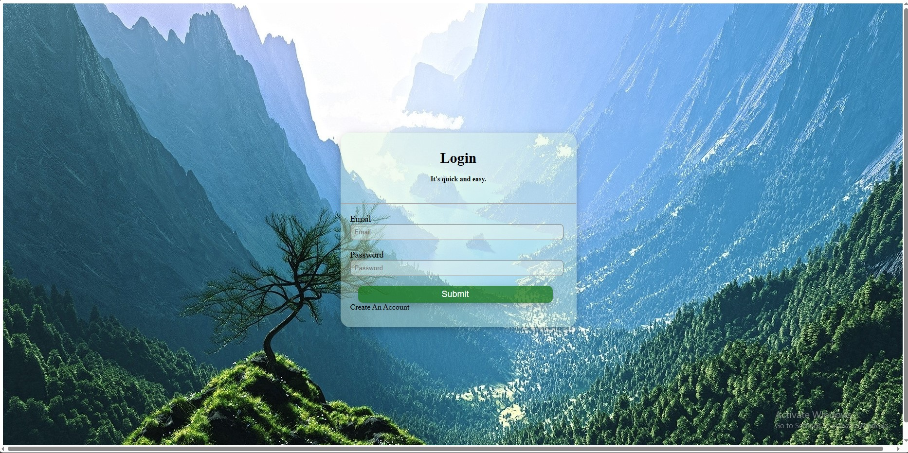
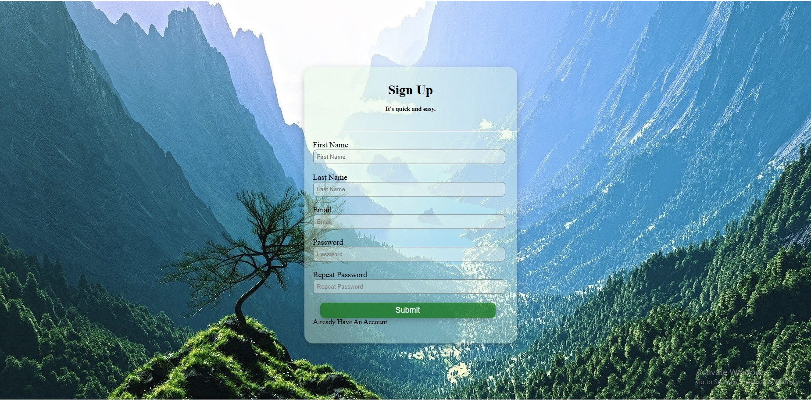
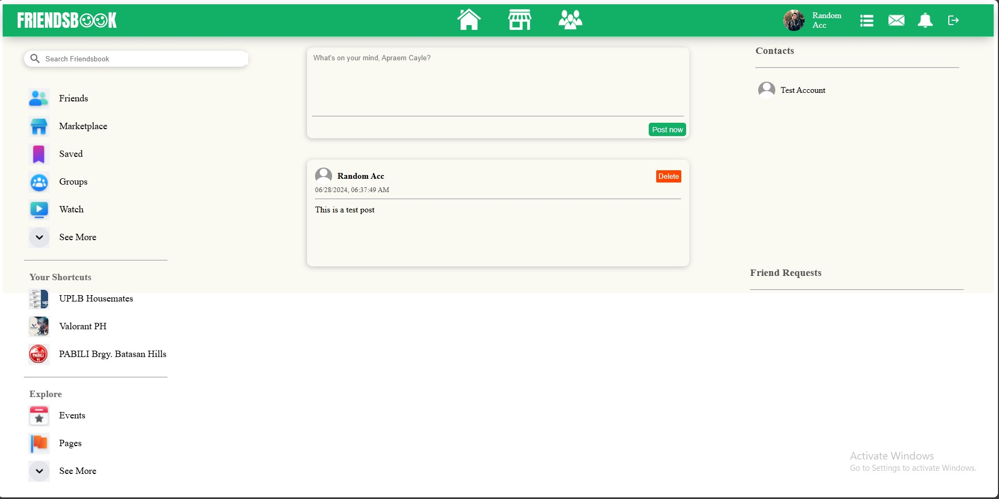

# Friendsbook
Simple social media application utilizing the MongoDb, ExpressJs, ReactJs, and NodeJs (MERN stack). This was created as a final project for my CMSC 100 course.

### Features
1. sign-up/login
2. post creation/edition/deletion
3. user search
4. friends feature

### Screenshots

### Author
Apraem Cayle Mabaga
